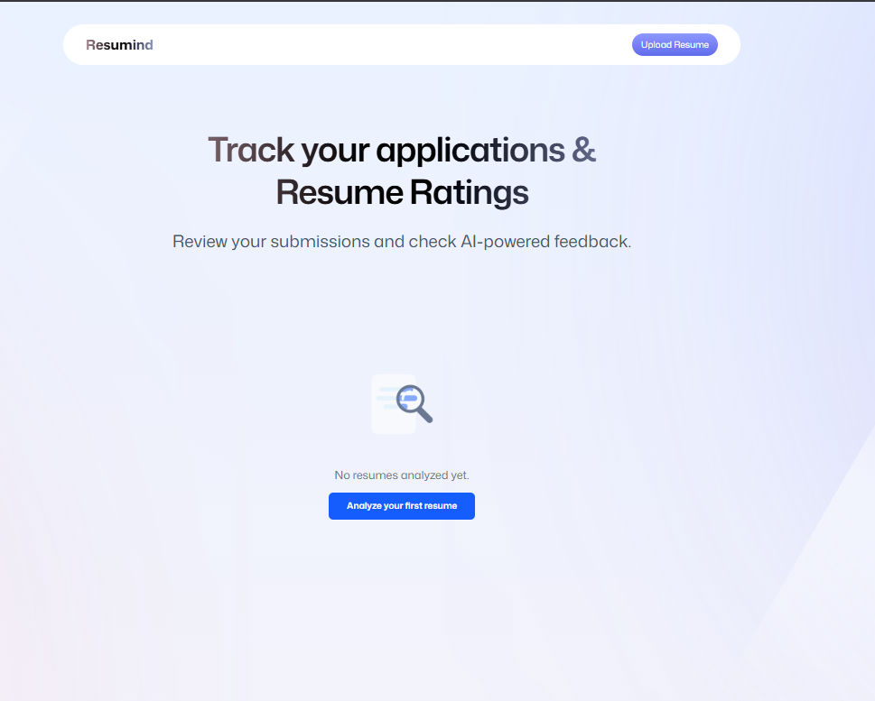

# Resumind — AI Resume Analyzer

An AI-powered resume analyzer that gives instant, structured feedback on your resume against a specific job description. Built with React Router v7, Puter.js, and Claude AI.



---

## Features

- **AI Resume Analysis** — Upload your resume PDF and get detailed feedback powered by Claude AI
- **ATS Scoring** — See how well your resume performs against Applicant Tracking Systems
- **Section Scores** — Individual scores for ATS compatibility, Tone & Style, Content, Structure, and Skills
- **Actionable Tips** — Color-coded good/improve tips with detailed explanations for each section
- **PDF Thumbnail Preview** — Auto-generates a visual preview of your resume on upload
- **Kanban Job Tracker** — Drag and drop your resumes across Applied, Interview, Offer, and Rejected stages
- **Grid & Kanban Views** — Switch between a card grid and a Kanban board on the home page
- **Export as PDF** — Print your full feedback report as a PDF from the detail page
- **Delete Resumes** — Remove resumes and their files cleanly from cloud storage
- **Puter Auth** — Secure, per-user cloud storage — your data stays in your own Puter account

---

## Tech Stack

| Layer | Technology |
|---|---|
| Framework | React Router v7 (Vite) |
| Language | TypeScript |
| Styling | Tailwind CSS v4 |
| State Management | Zustand |
| AI | Claude (via Puter.js `puter.ai.chat`) |
| Storage | Puter.fs (file storage) + Puter KV (key-value store) |
| Auth | Puter.js auth |
| PDF Processing | pdfjs-dist |
| Notifications | Sonner |
| File Upload | react-dropzone |

---

## Project Structure

```
├── app/
│   ├── components/
│   │   ├── FileUploader.tsx       # Drag-and-drop PDF uploader
│   │   ├── KanbanBoard.tsx        # Drag-and-drop job tracker board
│   │   ├── Navbar.tsx             # Top navigation bar
│   │   ├── ResumeCard.tsx         # Resume card + skeleton loader
│   │   └── ScoreCircle.tsx        # Animated circular score indicator
│   ├── lib/
│   │   ├── pdf2img.ts             # PDF to image conversion (pdfjs-dist)
│   │   ├── puter.ts               # Puter.js Zustand store (auth, fs, ai, kv)
│   │   └── utils.ts               # Utility helpers
│   ├── routes/
│   │   ├── auth.tsx               # Sign in / sign out page
│   │   ├── home.tsx               # Home page (grid + kanban views)
│   │   ├── resume-detail.tsx      # Resume analysis detail page
│   │   └── upload.tsx             # Resume upload & analysis flow
│   ├── root.tsx                   # App shell, Toaster provider
│   └── app.css                    # Global styles
├── constants/
│   └── index.ts                   # AI prompt, response format, sample data
├── types/
│   ├── index.d.ts                 # Global TypeScript interfaces
│   └── puter.d.ts                 # Puter.js type declarations
├── public/
│   ├── icons/                     # SVG icons
│   ├── images/                    # Background images and GIFs
│   └── pdf.worker.min.mjs         # PDF.js worker
├── vercel.json                    # Vercel SPA routing config
└── react-router.config.ts         # React Router configuration
```

---

## Getting Started

### Prerequisites

- Node.js 18+
- A free [Puter account](https://puter.com) — required for auth, storage, and AI

### Installation

```bash
# Clone the repository
git clone https://github.com/yourusername/resumind.git
cd resumind

# Install dependencies
npm install

# Start the development server
npm run dev
```

Open [http://localhost:5173](http://localhost:5173) in your browser.

---

## How It Works

### Upload & Analysis Flow

1. User signs in with their Puter account
2. User fills in company name, job title, job description, and uploads a resume PDF
3. The PDF is uploaded to **Puter.fs** (cloud file storage)
4. A thumbnail preview image is generated from page 1 of the PDF using **pdfjs-dist** and also uploaded to Puter.fs
5. Initial resume metadata is saved to **Puter KV** with `status: "analyzing"`
6. The PDF is read back from Puter.fs, converted to base64, and sent to **Claude AI** via `puter.ai.chat()` as a document block alongside a structured analysis prompt
7. Claude returns a structured JSON feedback object
8. The feedback is parsed and saved back to Puter KV with `status: "analyzed"`
9. User is redirected to the detail page showing their full analysis


### Kanban Tracker

Each resume has a `stage` field stored in Puter KV. Stages are:

- **Applied** — default for all new resumes
- **Interview** — moved when you get an interview
- **Offer** — moved when you receive an offer
- **Rejected** — moved when the application is closed

Drag a card from one column to another — the stage is persisted to Puter KV automatically.

---

## Authentication

Resumind uses **Puter.js auth**. Each user signs in with their own free Puter account. This means:

- Your resumes are stored in **your own** Puter cloud storage — not a shared database
- AI analysis runs against **your own** Puter AI quota — not the developer's
- No backend or database is required — the app is fully client-side

New users can create a free Puter account at [puter.com](https://puter.com) in under 30 seconds.

---

## Deployment

### Vercel (Recommended)

The `vercel.json` at the project root is already configured for SPA routing.

```bash
# Build the project
npm run build

# Deploy with Vercel CLI
vercel --prod
```

Or connect your GitHub repository in the [Vercel dashboard](https://vercel.com) for automatic deployments on every push.

### Other Platforms (Netlify, etc.)

Since this is a fully client-side SPA, any static hosting platform works. Make sure to configure a catch-all redirect to `index.html` for client-side routing to work correctly on direct URL access.

---

## Scripts

```bash
npm run dev        # Start development server
npm run build      # Build for production
npm run start      # Serve the production build
npm run typecheck  # Run TypeScript type checking
```

---

## Key Design Decisions

**Why Puter.js?**
Puter.js provides free cloud storage, key-value store, and AI access (Claude/GPT) all client-side with no backend required. Each user's data is isolated in their own Puter account, making it ideal for a shareable personal tool.

**Why not a custom backend?**
A backend would require hosting, a database, and managing API keys and user data. Puter handles all of this for free, keeping the architecture simple and the app deployable as a static site.

---

## Acknowledgements

- Built following the [JSMastery](https://www.jsmastery.pro) project tutorial
- PDF processing by [PDF.js](https://mozilla.github.io/pdf.js/)